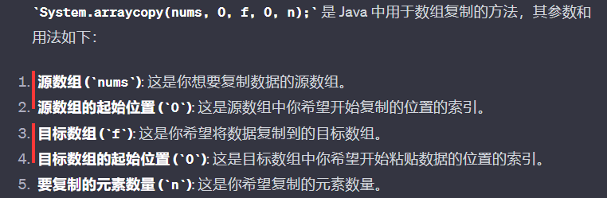

# 题目

1. https://leetcode.cn/problems/collecting-chocolates/?envType=daily-question&envId=2023-12-28
2. 一张桌子上有n件商品围成一圈，每件都有一个价签，它们构成数组nums。除了按照价签上的价格买东西之外，你还可以花x块钱把桌子转一下，把每件商品都对应到下一个价签，问把每种商品买一遍最少花多少钱

# 枚举

1. System.arraycopy(nums, 0, f, 0, n);

3. 为什么 相对于使用循环逐个复制元素，它的执行效率更高。

   总体而言，`System.arraycopy` 是一个被高度优化且针对底层内存复制的方法，适用于大规模数据的快速复制，相比手动循环复制，更能发挥硬件和虚拟机的优势。

4. 养成习惯 int n = nums.length;

5. 新建数组 int[] f = new int[n];

6. 外层循环把桌子转动的次数遍历一遍；内层循环在每次转动后更新各个位置的最小成本；ans去取舍；

   注意到在ans取舍时候，其实如果多个物体的最小成本被更新，他们是共用的同一转动成本k*x，很妙

# 二次差分

