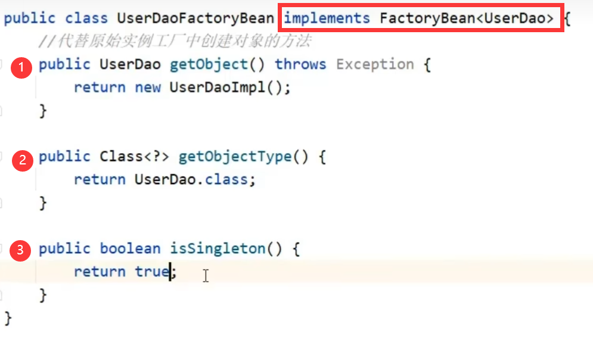

#### 简洁回答
Spring 容器通过**配置或注解**管理 **Bean 的生命周期**（从创建到销毁的整个过程），包括以下阶段：
1. **创建对象，分配内存**
2. **实例化：执行构造方法**
3. **属性注入：set操作**
4. **bean初始化（Initialization）：** `implements InitializingBean` ，调用其 `afterPropertiesSet()` 方法。
5. **使用bean，执行业务操作**
6. **销毁容器阶段（Destruction）：** `implements DisposableBean` ，调用其 `destroy()` 方法。

---

#### 前置知识
- bean作用范围
- bean默认单例
	- 适合交给容器管理的bean：Service、Dao层对象
	- 不适合交给容器管理的bean：封装实体的域对象（有指定值）
- bean实例化
	1. 构造方法：无参构造方法、反射获取
	3. 静态工厂：`factory-method`
		```xml
		<bean id="orderDao" class="com.itheima.factory.OrderDaoFactory" factory-method ="getorderDao"/>
		```
	3. 实例工厂：
		- factory-bean="xx"
			```xml
			<bean id="userFactory" class="com.itheima.factory.UserDaoFactory" >
			<bean id="userDao" factory-method="getuserDao" factory-bean="userFactory" />
			```
		- FactoryBean
			

---

#### 详细回答
1. **创建对象，分配内存**
2. **实例化：执行构造方法**
3. **属性注入：set操作**
4. **bean初始化（Initialization）：**
	- 自定义配置： `@PostConstruct` 或`init-method="xx"`
	- 实现接口： `implements InitializingBean` ，调用其 `afterPropertiesSet()` 方法。
		- 注意：在set方法的属性设置之后才执行该方法
5. **使用bean，执行业务操作**
6. **销毁容器阶段（Destruction）：**
	- 自定义配置： `@PreDestroy` 或`destroy-method="xx"`
		- 注意：容器关闭时调用销毁逻辑，要想看到destroy-method执行：
			1. 暴力手动关闭：在JVM结束前通过`ClassPathXmlApplication接口close()方法`关闭容器
			2. 注册关闭钩子：`ClassPathXmlApplication接口registerShutdownHook()方法`
	- 实现接口： `implements DisposableBean` ，调用其 `destroy()` 方法。

---

#### 延伸问答
- [x]  **如何自定义 Bean 的初始化和销毁行为？**
	- 在配置文件中指定 `init-method="xx"` 和 `destroy-method="xx"`
	- 使用注解 `@PostConstruct` 和 `@PreDestroy`：
- [ ]  **Spring Bean 生命周期的扩展点有哪些？**
	- 使用 `BeanPostProcessor` 在初始化前后执行自定义逻辑。
	- 使用 `BeanFactoryPostProcessor` 修改 Bean 的定义或属性。
- [ ]  **不同作用域的生命周期有何区别？**
	- `singleton`：与容器生命周期一致，容器关闭时销毁。
	- `prototype`：每次获取新实例，无全局生命周期管理，不执行销毁方法。