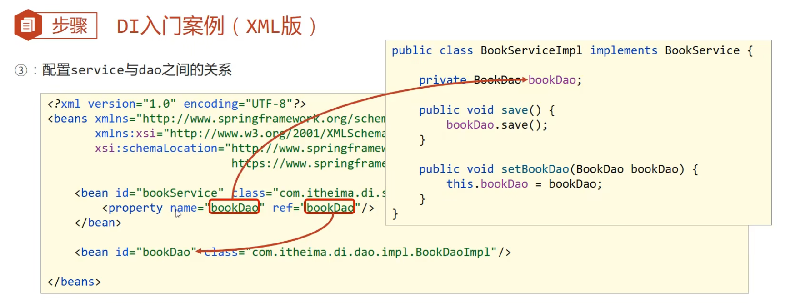
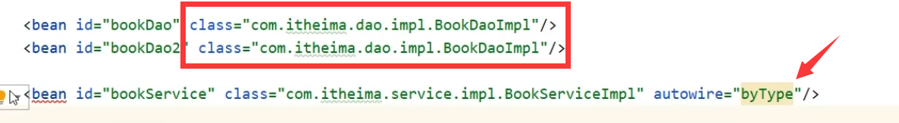

#### 简洁回答
- **控制反转（Inversion of Control, IoC）：** 指将对象的创建、初始化及依赖管理的控制权从应用代码转移到 Spring 容器。
	- 传统方式： 对象由程序创建，依赖通过硬编码传递（代码写死而不是通过配置动态控制），高耦合。
	- IoC 方式： Spring 容器负责对象创建和依赖，模块之间只需要声明依赖，低耦合。
- **依赖注入（Dependency Injection, DI）：** 是 IoC 的具体实现方式，容器根据配置将所需的依赖注入到对象中。
	1. Setter 注入。适合可选依赖的注入，配置`<bean>`用`<property>`标签的`value`或`ref`属性。
	2. 构造器注入（推荐）。适合强制依赖的注入，配置`<bean>`用`<constructor-arg>`标签的`value`或`ref`属性。
	3. 自动装配（不推荐）。配置`<bean>`用`autowire="xx"`。

---

#### 详细回答
#####  **1. IoC入门案例**
**思路：**
- **如何将被管理的对象告知IoC容器？** 配置。
- **如何获取到IoC容器？** 接口。
- **如何从容其中获取bean？** 接口方法。

**实践：**
1. **导入和配置。** 导入坐标`spring-context`后新建配置文件`applicationContext.xml`并配置bean（包括id，class）
2. **获取IoC容器。** `new ClassPathXmlApplicationContext("applicationContext.xml")`
3. **获取bean。** `ctx.getBean("bookDao")`

#####  **2. DI的三种注入方法**
**思路：**
- **注入什么类型？** 
	- **简单类型（如int、String）**。用`<property>`标签的`value`属性
	- **引用类型**。用`<property>`标签的`ref`属性
	- **集合**。用`<property>`标签的`<array>``<list>``<set>``<map>``<props>`子标签

**实践：**
1. **Setter 注入**：通过 Setter 方法，配置`<bean>`用`<property>`标签的`value`或`ref`属性注入。
	- 如果只有Setter方法，没有注入，会导致null对象出现。
	- 适用于可选依赖的注入、自己开发的模块的注入。
	
2. **构造器注入（Spring推荐）**：通过构造函数，配置`<bean>`用`<constructor-arg>`标签的`value`或`ref`属性注入。
	- 形参名的耦合问题解决：用`type`属性替代`name`属性。
	- 多个同类型的解决：用`index`属性替代`type`属性。
	- 适用于强制依赖的注入、第三方不含setter的模块的注入。
3. **自动装配（不推荐）**：配置`<bean>`用`autowire="xx"`，通过Setter方法 或 直接在字段上使用 `@Autowired`注入。
	- `autowire="byType"`按类型装配（推荐）。
		- 发现有多个class相同的bean，那装配谁呢？失败。
		- 
	- `autowire="byName"`按名称装配。（不推荐，因为变量名与配置耦合）

---

#### 延申问题
- 关于 IoC 概念的追问
	- [x] **控制反转和依赖注入有什么区别？它们的关系是什么？**
		-  IoC 是一种思想，而 DI 是其实现方式
- 关于 IoC 工作原理的追问
	- [x] **Spring 是如何管理 Bean 的生命周期的？有哪些生命周期方法？**
		-  Spring 通过容器管理 Bean 的完整生命周期，包括创建、初始化、使用和销毁。
		-  生命周期方法
			1.  `@PostConstruct`（初始化）
			2.  `@PreDestroy`（销毁）
			3.  接口方法（如 `InitializingBean.afterPropertiesSet()` 和 `DisposableBean.destroy()`）。
	- [x] **Bean 的作用域有哪些？如何配置不同作用域？**
		- 作用域
			1.  `singleton`（默认，每个容器只有一个实例）
			2.  `prototype`（每次获取新实例）
			3.  `request` 和 `session`（用于 Web 应用）。
		- 可通过 `@Scope` 注解设置作用域：`@Scope("prototype")`
	- [x] **在依赖注入过程中，如何解决循环依赖问题？**
		- Spring 使用三级缓存解决循环依赖，允许提前暴露 Bean 引用，避免死循环。
			1. SingletonFactory
			2. Early Bean Reference
			3. Fully Initialized Bean
- 关于 IoC 实现方式的追问
	- [x] **构造器注入与 Setter 注入的区别和使用场景是什么？为什么推荐构造器注入？**
		- Setter 注入适用于可选依赖的注入、自己开发的模块的注入。
		- 构造器注入适用于强制依赖的注入、第三方不含setter的模块的注入。
	- [x] **为什么字段注入不推荐？如果必须使用，如何规避其缺点？**
		- 字段注入会导致无法在单元测试中手动注入 Mock 对象，降低代码可测试性。
		- 如果必须使用，可结合 `ReflectionTestUtils` 或依赖注入框架来替代。
	- [x] **当一个 Bean 需要多个依赖时，如何优雅地管理这些依赖？**
		- 使用构造器注入，并结合 `@Qualifier` 或策略模式来明确依赖关系，避免注入混乱。
- 关于实际应用的追问
	- [x] **如果需要动态注入依赖，比如运行时决定使用哪个实现，如何实现？**
		- 可使用 `@Qualifier` 指定 Bean
		- 可通过 `@Conditional` 注解根据条件动态加载 Bean。
	- [x] **如何使用第三方库实现 IoC？Spring IoC 与其他 IoC 框架（如 Guice）相比有何优势？**
		- 第三方库： Guice IoC 框架。
		- Spring IoC 提供更丰富的生态（如 AOP、数据访问支持）和灵活的配置方式（XML、注解、JavaConfig）